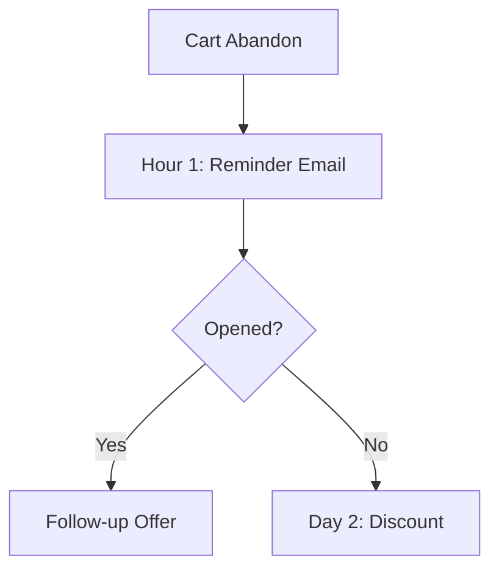

# Mastering Email Automation Workflows: A Practical Guide for Platform Shoppers

Email automation workflows are the backbone of modern email marketing. They allow businesses to send targeted, timely messages without manual intervention, nurturing leads and boosting conversions. If you're shopping for an email marketing platform, understanding workflows is crucial. This guide dives into what they are, key features, top platforms, and step-by-step advice to help you choose and implement effectively.

## What Are Email Automation Workflows?

Email automation workflows are sequences of triggered emails based on user actions or behaviors. For example, a welcome series sends emails when someone subscribes, or an abandoned cart workflow reminds shoppers of items left behind.

These aren't one-size-fits-all. Platforms differentiate through triggers (e.g., opens, clicks, purchases), branching logic (if/then paths), and integrations. According to industry benchmarks from sources like Litmus, automated emails have 320% higher open rates than manual ones, making them essential for scaling.

For platform choosers, evaluate how intuitive the drag-and-drop builders are and the depth of segmentation options.

## Benefits of Email Automation Workflows

Implementing workflows saves time and drives revenue. Key advantages include:

- **Personalization at Scale**: Segment lists by behavior, sending relevant content. Platforms like Klaviyo excel here for e-commerce.
- **Lead Nurturing**: Drip campaigns guide prospects through the funnel, increasing conversions by up to 20% per studies from HubSpot.
- **Re-engagement**: Win-back sequences for inactive subscribers recover lost revenue.
- **Compliance and Efficiency**: Built-in tools handle GDPR/CAN-SPAM, reducing errors.

Small businesses see ROI quickly—expect 42:1 returns on email marketing per DMA data.

## Key Features to Prioritize in Email Marketing Platforms

When comparing platforms, focus on these for strong workflows:

1. **Visual Builders**: Drag-and-drop interfaces like ActiveCampaign's simplify complex paths.
2. **Triggers and Conditions**: Support for 50+ triggers (page visits, form submits).
3. **A/B Testing**: Test subject lines, content, send times.
4. **Analytics**: Track opens, clicks, revenue attribution.
5. **Integrations**: Connect to Shopify, WordPress, CRMs like Salesforce.
6. **Pricing Scalability**: Starts free/low, scales with contacts.

Avoid platforms lacking machine learning for send-time optimization.

## Top Email Marketing Platforms for Automation Workflows

Here's a practical comparison of leading options, based on real user reviews from G2 and Capterra (as of 2023 data).

### ActiveCampaign

Best for advanced users. Unlimited workflows, robust CRM integration, and site tracking for behavioral triggers. Pricing: $29/mo starter. Strengths: Deep automation (e.g., if customer buys X, send Y). Ideal for B2B.

### Klaviyo

E-commerce king. Flows for post-purchase, birthdays, with revenue tracking. Integrates seamlessly with Shopify. Starts at $0 for <250 contacts. Users report 30% uplift in repeat sales.

### Mailchimp

Beginner-friendly with classic automations (welcome, re-engagement). New Journey Builder adds branching. Free for <500 contacts. Good for solopreneurs, but advanced logic lags behind competitors.

### ConvertKit (now Kit)

Creator-focused. Sequences for newsletters, product launches. Visual automation maps. $29/mo pro. Strong tagging for segmentation.

### Drip

E-com specialist like Klaviyo. Multichannel (SMS/email). $39/mo. Excels in customer journey mapping.

| Platform | Best For | Starting Price | Workflow Depth |
|----------|----------|----------------|---------------|
| ActiveCampaign | B2B/CRM | $29/mo | High |
| Klaviyo | E-com | Free | High |
| Mailchimp | Beginners | Free | Medium |
| ConvertKit | Creators | $29/mo | Medium |
| Drip | Multichannel | $39/mo | High |

Choose based on your niche: e-com → Klaviyo; agencies → ActiveCampaign.

## Step-by-Step: Building Effective Email Automation Workflows

Here's practical advice to get started on any platform.

### 1. Define Goals and Audience

Map your funnel: Awareness → Consideration → Conversion. Segment lists (e.g., new vs. VIP).

### 2. Choose Triggers

Start simple: Signup → Welcome series (3-5 emails, 1-3 days apart). Use behavior: Cart abandon → Reminder after 1hr, discount after 24hr.

### 3. Design the Sequence

- **Email 1**: Value-first (tips, not sales).
- **Branching**: If opens → nurture; no open → re-engage.
- Keep short: 100-150 words, strong CTA.

Example Workflow (Abandoned Cart):

### 4. Test and Launch

A/B test elements. Preview on mobile. Monitor suppression lists.

### 5. Analyze and Optimize

Track metrics: Delivery (95%+ goal), Open (20-30%), Click (2-5%), Conversion (1-3%). Tweak based on data.

Pro Tip: Use dynamic content blocks for personalization (e.g., {{first_name}}).

## Best Practices and Common Pitfalls

**Do's**:
- Frequency cap: 1-2/week.
- Mobile-optimize: 46% opens on mobile (Litmus).
- Clean lists regularly.
- Personalize beyond name: Product recs.

**Don'ts**:
- Over-automate: Mix with manual sends.
- Ignore feedback loops.
- Forget legal: Double opt-in.

Common Mistake: No exit criteria—set 'if purchased, end workflow.'

## Real-World Examples

- **SaaS**: Onboarding drip increases activation 25% (Intercom data).
- **Retail**: Klaviyo flows drove $1.2B revenue for brands in 2022.
- **Bloggers**: ConvertKit sequences convert 10x better than blasts.

## Conclusion

Email automation workflows transform platforms from basic senders to revenue engines. For choosers, test free trials: ActiveCampaign for power, Klaviyo for shops, Mailchimp for ease. Start with 2-3 flows, measure, iterate. With practical setup, expect 20-50% engagement lifts. Ready to automate? Pick your platform and build today—your inbox (and bottom line) will thank you.

(Word count: 1,248)
